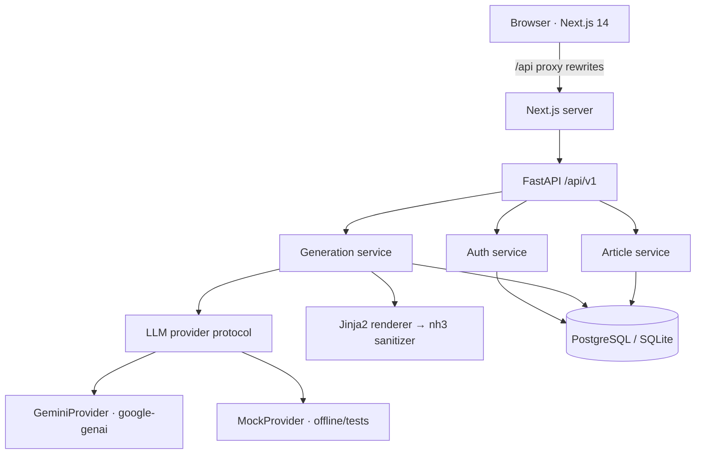

# SearchScribe AI Studio

**One search query → a structured AI article, validated SEO metadata, and a sanitized, ready-to-publish HTML page.**

SearchScribe is a full-stack AI content platform: a FastAPI backend with a provider-independent LLM layer, a Next.js 14 frontend, PostgreSQL via SQLAlchemy 2.x + Alembic, rotating refresh-cookie sessions, article versioning, and a multi-style rewrite engine.

---

## Features

- **Account & sessions** — signup/login/logout with Argon2id password hashing, short-lived access JWTs held in memory, rotating HttpOnly refresh cookies (theft detection included).
- **Article generation** — a query becomes a structured article (title / intro / sections / conclusion), deterministic Markdown + standalone HTML, all schema-validated.
- **SEO engine** — separate LLM pass for title, meta description, keywords, and Open Graph fields, clamped by deterministic rules (title ≤ 60, description ≤ 160 chars).
- **Rewrite styles** — Professional, Casual, Gen Z, Technical, Marketing, Minimal. Every rewrite is a new immutable version.
- **Version history** — list, inspect, and restore any version without losing history.
- **Hardened HTML** — the LLM never emits HTML: Jinja2 autoescaping renders it, nh3 sanitizes it again, the preview iframe is fully sandboxed.
- **Production posture** — request IDs, structured JSON logs, error envelopes, rate limiting, health/readiness probes, Docker + CI.

## Architecture



The application is a **modular monolith**: routers stay thin, business logic lives in services, data access in repositories, and every LLM call goes through one provider protocol. See [docs/architecture.md](docs/architecture.md).

## Tech stack

| Layer     | Choices                                                                  |
| --------- | ------------------------------------------------------------------------ |
| Backend   | Python 3.12+, FastAPI, Pydantic v2, SQLAlchemy 2.x, Alembic, PyJWT, argon2-cffi, nh3, Jinja2 |
| AI        | google-genai (Gemini 2.5 Flash default) behind an `LLMProvider` protocol + offline MockProvider |
| Frontend  | Next.js 14 (App Router), TypeScript strict, TanStack Query, Zod, React Hook Form, Tailwind CSS, DOMPurify |
| Data      | PostgreSQL (docker-compose), SQLite (zero-setup local dev)               |
| Testing   | pytest (55 backend tests), Vitest + Testing Library, Playwright E2E      |
| Infra     | Docker multi-stage non-root images, docker-compose, GitHub Actions CI    |

## Repository structure

```
SearchScribe_AI_Studio/
├── backend/
│   ├── app/
│   │   ├── api/v1/          # thin HTTP routers (auth, articles, health)
│   │   ├── core/            # config, security, logging, errors, rate limiting
│   │   ├── db/              # session, declarative base, models
│   │   ├── schemas/         # Pydantic request/response models
│   │   ├── services/        # business logic (auth, generation, articles)
│   │   ├── repositories/    # user-scoped data access
│   │   └── ai/              # provider protocol, Gemini, Mock, prompts,
│   │                        # structured-output schemas, renderer, sanitizer
│   ├── alembic/             # migrations
│   └── tests/               # unit + API tests (mock provider, no network)
├── frontend/
│   ├── app/                 # Next.js App Router pages
│   ├── features/            # auth, articles (feature-based modules)
│   ├── components/shared/   # accessible Tabs, loading/empty/error states
│   ├── lib/api/             # typed API client + Zod schemas
│   ├── e2e/                 # Playwright specs + backend startup script
│   └── Dockerfile
├── docs/                    # architecture, API, security, ADRs, ...
├── docker-compose.yml       # postgres + redis + backend + frontend
└── .github/workflows/ci.yml
```

## Local development

### Backend

```bash
cd backend
python -m venv ../.venv && ../.venv/Scripts/pip install -r requirements.txt -r requirements-dev.txt  # Windows
cp .env.example .env                 # fill in GEMINI_API_KEY (or set AI_PROVIDER=mock)
../.venv/Scripts/python -m alembic upgrade head
../.venv/Scripts/python -m uvicorn app.main:app --reload
```

- API: http://127.0.0.1:8000 · Docs: http://127.0.0.1:8000/docs
- No Gemini key? Run with `AI_PROVIDER=mock` — the whole product works offline.

### Frontend

```bash
cd frontend
npm install
npm run dev
```

http://localhost:3000 — the Next.js server proxies `/api/*` to the backend (see `next.config.mjs`), which keeps the refresh cookie first-party.

### Tests

```bash
# Backend (unit + API, fully offline)
cd backend && ../.venv/Scripts/python -m pytest

# Frontend unit tests
cd frontend && npm test

# E2E: boots backend (:8001, mock AI) + frontend (:3100) automatically
cd frontend && npx playwright test
```

### Docker (production-like)

```bash
docker compose up --build
# frontend http://localhost:3000 · backend http://localhost:8000/docs
# AI_PROVIDER=mock docker compose up   # keyless demo mode
```

Migrations run automatically at container start (`alembic upgrade head` in the CMD).

## Environment variables

All settings are typed and validated in `backend/app/core/config.py`. See [`backend/.env.example`](backend/.env.example) for the full annotated list. Highlights:

| Variable                       | Default                        | Purpose                                  |
| ------------------------------ | ------------------------------ | ---------------------------------------- |
| `APP_ENV`                      | `local`                        | `production` disables docs, secures cookies |
| `DATABASE_URL`                 | `sqlite:///./searchscribe.db`  | SQLite dev default; Postgres in compose  |
| `SECRET_KEY`                   | —                              | JWT signing key; required in production  |
| `AI_PROVIDER` / `AI_MODEL`     | `gemini` / `gemini-2.5-flash`  | `mock` for offline mode                  |
| `GEMINI_API_KEY`               | —                              | Google AI Studio key (free tier works)   |
| `CORS_ORIGINS`                 | localhost:3000                 | Comma-separated allowed origins          |
| `RATE_LIMIT_*_PER_MINUTE`      | 10 auth / 5 generation         | Sliding-window limits                    |

Never commit `.env`. Generate a strong key with
`python -c "import secrets; print(secrets.token_urlsafe(48))"`.

## API overview

All endpoints are versioned under `/api/v1` and return a consistent error envelope (`{"error": {"code", "message", "request_id"}}`):

```
POST   /api/v1/auth/signup|login|refresh|logout     Sessions & tokens
GET    /api/v1/auth/me                              Current user
POST   /api/v1/articles                             Generate (rate-limited)
GET    /api/v1/articles?limit=&cursor=              Cursor pagination
GET    /api/v1/articles/{id}                        Detail: markdown + SEO + HTML
PATCH  /api/v1/articles/{id}                        Rename
DELETE /api/v1/articles/{id}                        Delete (cascades versions)
POST   /api/v1/articles/{id}/duplicate              Copy
POST   /api/v1/articles/{id}/rewrite                {style} → new version
GET    /api/v1/articles/{id}/versions[/{version}]   History & inspection
POST   /api/v1/articles/{id}/versions/{v}/restore   Restore as newest
GET    /api/v1/articles/rewrite-styles              Available styles
GET    /api/v1/health | /ready                      Probes
```

Full request/response schemas: [docs/api.md](docs/api.md) and the interactive `/docs`.

## Documentation

- [Architecture](docs/architecture.md) — layers, data flow, request lifecycle
- [AI architecture](docs/ai-architecture.md) — provider protocol, prompts, pipeline, failure policy
- [Database](docs/database.md) — schema, migrations, pagination strategy
- [Security](docs/security.md) — auth design, sanitization, rate limiting
- [Testing](docs/testing.md) — what's covered and how to run it
- [Deployment](docs/deployment.md) — Docker, CI, production checklist
- [Decision records](docs/decisions/) — ADRs for the load-bearing choices

## Design decisions (short version)

| Decision | Why |
| --- | --- |
| Modular monolith | Right-sized; extractable later, no distributed overhead now |
| Provider protocol + factory | Swap/add LLMs with one file + env vars; tests never call real APIs |
| LLM returns structured JSON, never HTML | Deterministic rendering eliminates a whole class of XSS and layout failures |
| Access token in memory + rotating refresh cookie | XSS cannot exfiltrate what isn't in storage; rotation detects theft |
| SQLite dev / Postgres prod via one SQLAlchemy code path | Zero-setup local dev, production-grade storage |
| Fail loudly on provider errors | Never fabricate fake "successful" content |

Details and trade-offs in [docs/decisions/](docs/decisions/).

## Roadmap ideas

Background generation queue (Arq/Celery), SSE streaming, admin analytics over the `generations` table, exports (Markdown/PDF/DOCX), multi-language and brand-voice modes, research + citations. The architecture isolates each of these behind existing seams.

## Author

**Abhay Yemekar** · [GitHub](https://github.com/abhay-yemekar) · [LinkedIn](https://www.linkedin.com/in/abhayyemekar)

## License

[MIT](LICENSE)
