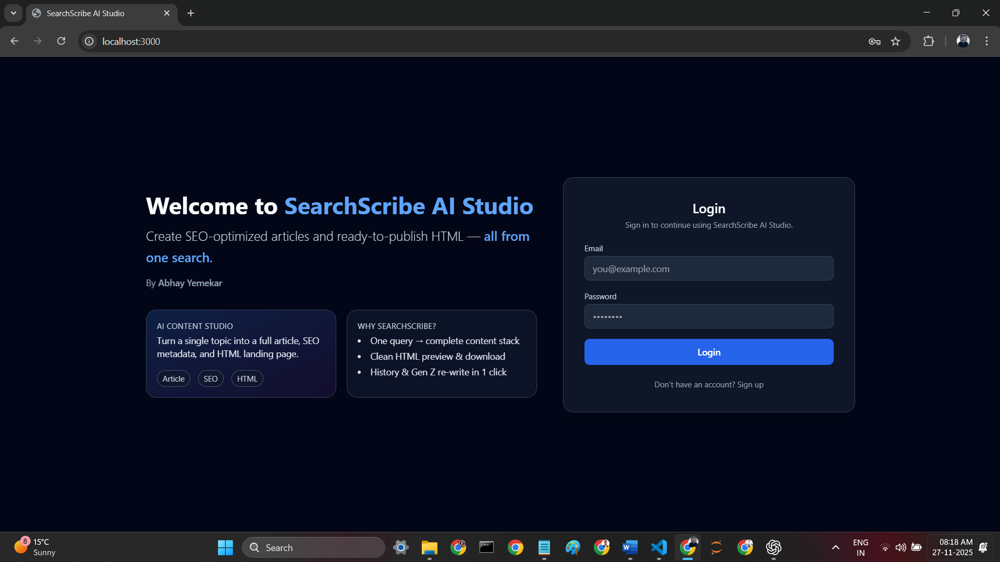
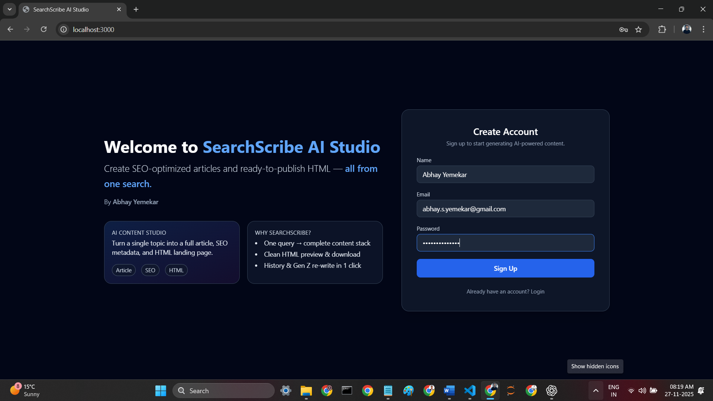
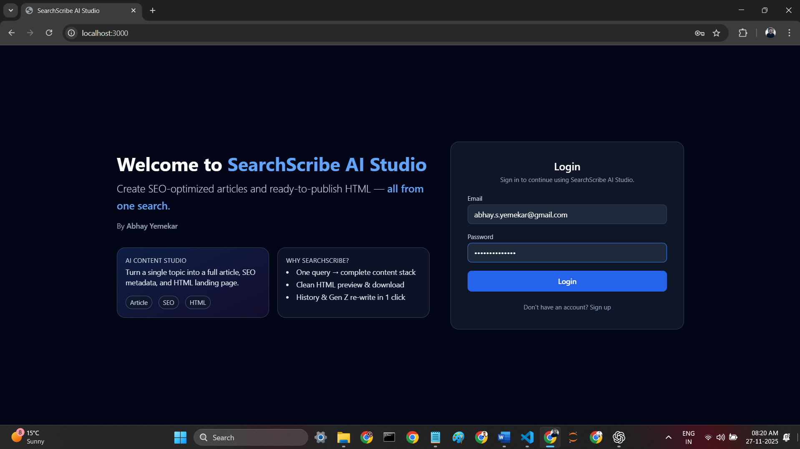
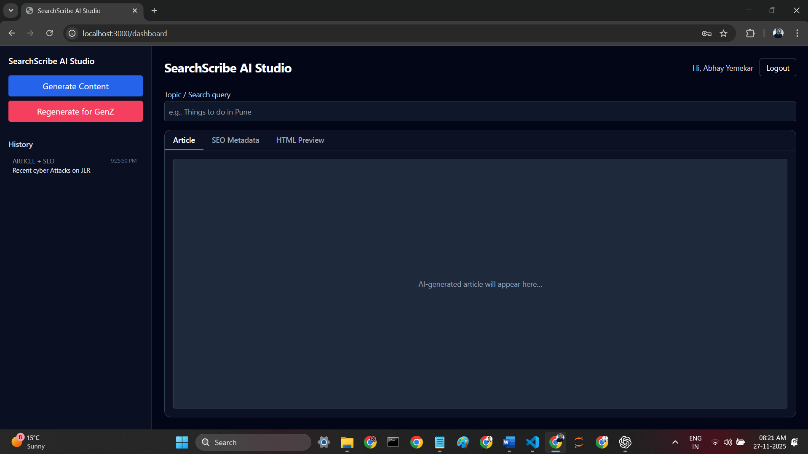
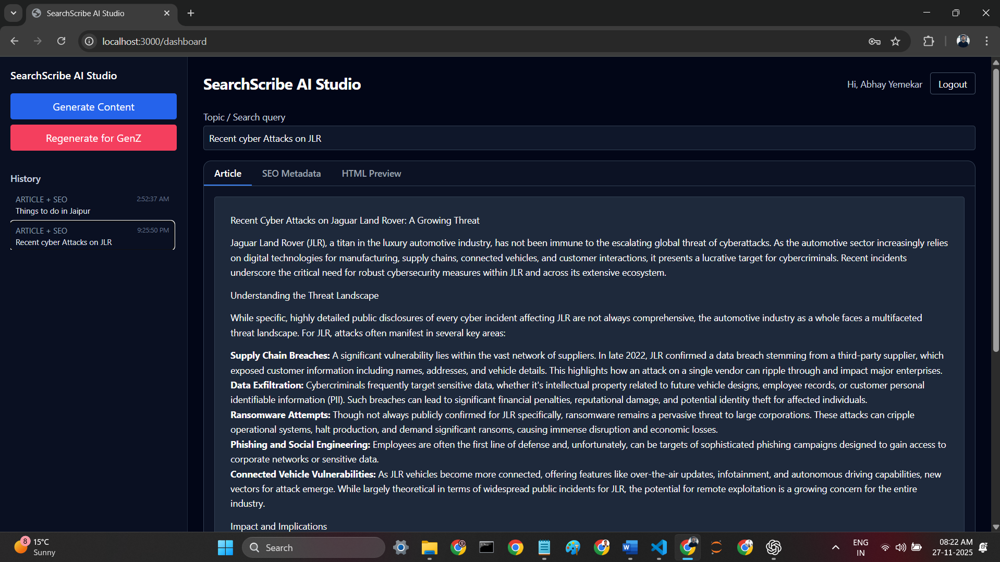
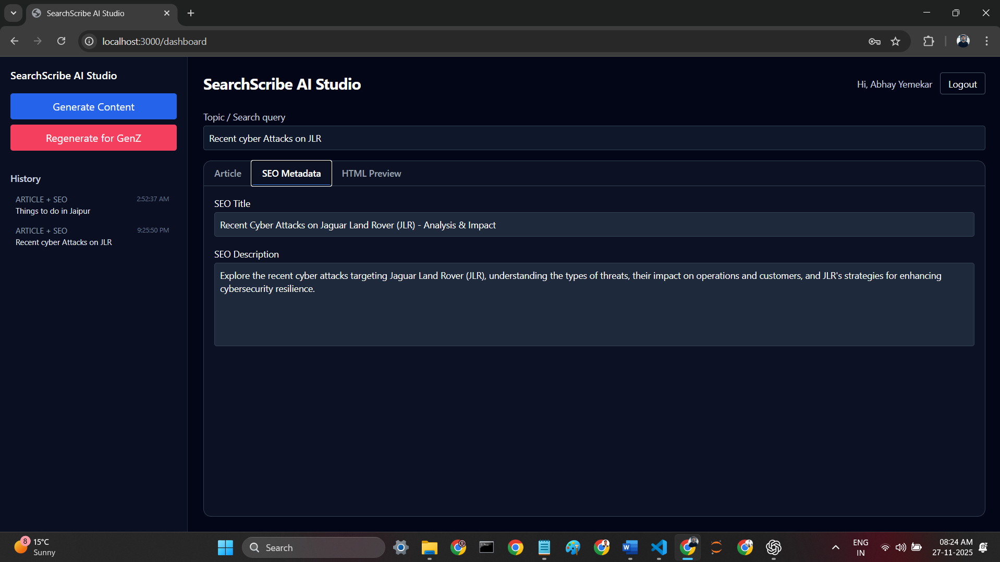
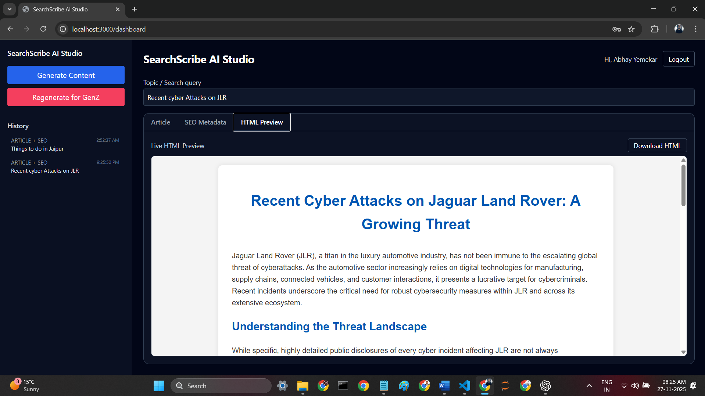
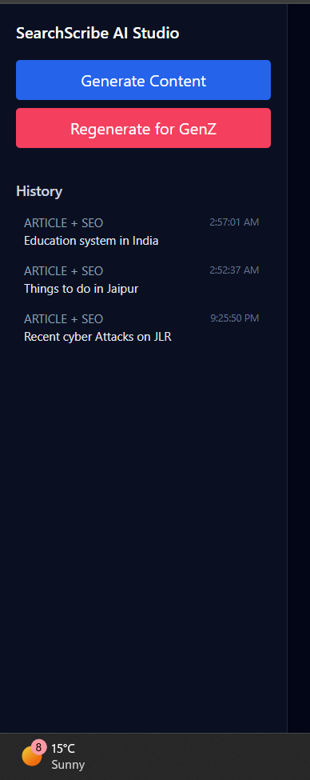
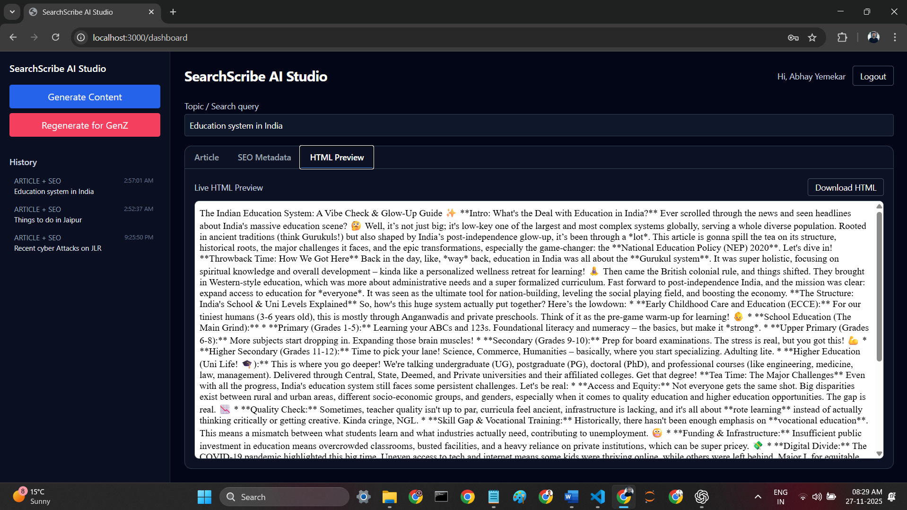

# 🌐 SearchScribe AI Studio

### **AI-powered Article Generator · SEO Metadata Engine · HTML Page Builder**

> **Tagline**  
> _Create SEO-optimized articles and ready-to-publish HTML — all from one search._

---

## 📌 Overview

**SearchScribe AI Studio** is a full-stack AI content engine that transforms a **single search query** into:

- ✨ AI-generated long-form articles  
- 🏷️ SEO metadata (Title + Meta Description)  
- 🌐 Ready-to-publish HTML pages  
- 🔁 1-click Gen-Z Tone Rewrite  
- 🕘 Automatic Content History Saving  
- 🔐 JWT Authentication System (Signup/Login/Logout)  

This project was developed as part of the **Align Labs Engineering Task**, demonstrating:

- Full-stack engineering using **FastAPI** + **Next.js 14**
- Integration with **Google Gemini LLM**  
- Product-grade UX with animations and a hero-style auth page  
- Well-structured backend routes and data flow  
- Deployment-ready architecture (Render + Vercel)  
- Clean, modular, scalable codebase  

---
## 📸 Screenshots

> Place all screenshots inside a folder named `screenshots/` at the root of your repo.

### 🔐 1. Landing Page – Auth + Hero

**File:** `screenshots/01_auth_landing_page.png`



---

### 📝 2. Signup Screen (with Name field)

**File:** `screenshots/02_signup_screen.png`



---

### 🔑 3. Login Screen

**File:** `screenshots/03_login_screen.png`



---

### 💻 4. Dashboard – Empty State

**File:** `screenshots/04_dashboard_empty_state.png`



---

### 🧾 5. Article Generated – Article Tab

**File:** `screenshots/05_dashboard_article_generated.png`



---

### 🏷️ 6. SEO Metadata Tab

**File:** `screenshots/06_seo_metadata_tab.png`



---

### 🌐 7. HTML Preview Tab + Download

**File:** `screenshots/07_html_preview_tab.png`



---

### 🕘 8. History Sidebar

**File:** `screenshots/08_history_sidebar.png`



---

### 😎 9. Gen-Z Rewrite Output (Optional)

**File:** `screenshots/09_genz_rewrite_output.png`



---

# 🧠 Features Overview

## 🔹 1. Search → AI Generated Content  
Enter any topic → Gemini generates:

- Rich article with headings
- SEO title & description
- Fully formatted HTML page

> Endpoint: `POST /content/generate`

---

## 🔹 2. HTML Preview + Download  
- Instant HTML rendering  
- Iframe-based preview  
- Download generated HTML in **one click**

> Component: `frontend/components/HtmlPreview.tsx`

---

## 🔹 3. Gen-Z Rewrite Mode  
Regenerates the same article with:

- Conversational tone  
- Short, punchy Gen-Z style  
- SEO preserved  

> Endpoint: `POST /content/regenerate`

---

## 🔹 4. Auto-Saved History (Stage 2 Implemented)  
Side panel tracks:

- All past queries  
- Timestamp  
- SEO + article + HTML  
- Click to reload content instantly  

> Logic in:  
`backend/history_store.py`  
`backend/app/models.py`  
`frontend/app/dashboard/page.tsx`

---

## 🔹 5. Full Authentication  
Includes:

- Signup → Name + Email + Password  
- Login → Email + Password  
- JWT token stored securely in localStorage  
- Logout → Clears session  
- Protected routes (Dashboard inaccessible without token)  

> Components:  
`frontend/components/AuthForm.tsx`  
`frontend/app/page.tsx`

---

## 🔹 6. Modern UI / UX  
- Hero section on login/signup page  
- Animations (fade-in / slide-in)  
- TailwindCSS  
- Dashboard with sidebar + tabs  
- Dark mode  
- Responsive layout  

> Tabs:  
`Article · SEO Metadata · HTML Preview`

---

# 🏗️ Architecture

```
SearchScribe-AI-Studio/
│
├── backend/
│   ├── .env.example
│   ├── history_store.py
│   ├── models.json
│   ├── requirements.txt
│   └── app/
│       ├── main.py
│       ├── auth.py
│       ├── config.py
│       ├── database.py
│       ├── deps.py
│       ├── llm_client.py
│       ├── models.py
│       ├── schemas.py
│       └── routers/
│           ├── auth_routes.py
│           └── content_routes.py
│
└── frontend/
    ├── app/
    │   ├── dashboard/page.tsx
    │   ├── layout.tsx
    │   ├── page.tsx
    │   ├── globals.css
    │
    ├── components/
    │   ├── AuthForm.tsx
    │   ├── Tabs.tsx
    │   ├── HtmlPreview.tsx
    │   ├── ContentForm.tsx
    │   ├── SeoMetadataCard.tsx
    │
    ├── lib/api.ts
    ├── package.json
    ├── tailwind.config.js
    ├── next.config.mjs
    ├── tsconfig.json
    └── postcss.config.js
```

---

# ⚙️ Local Development Setup

## 🔧 Backend (FastAPI)

### 1. Install dependencies
```bash
cd backend
pip install -r requirements.txt
```

### 2. Create `.env`
```
GEMINI_API_KEY=your_key_here
JWT_SECRET=your_secret_here
JWT_ALGORITHM=HS256
DATABASE_URL=sqlite:///./searchscribe.db
```

### 3. Start FastAPI
```bash
uvicorn app.main:app --reload
```

Backend runs at:

- API: http://127.0.0.1:8000  
- Docs: http://127.0.0.1:8000/docs  

---

## 🎨 Frontend (Next.js 14 + Tailwind)

### 1. Install dependencies
```bash
cd frontend
npm install
```

### 2. Add environment variables (`.env.local`)
```
NEXT_PUBLIC_API_URL=http://127.0.0.1:8000
```

### 3. Run frontend
```bash
npm run dev
```

Frontend runs at:

- http://localhost:3000

---

# ☁️ Deployment (Free)

## 🚀 Backend → Render

### Settings:
- Root Directory → `backend`
- Runtime → Python
- **Start Command:**
```bash
uvicorn app.main:app --host 0.0.0.0 --port 8000
```

### Environment Variables:
```
GEMINI_API_KEY
JWT_SECRET
JWT_ALGORITHM
DATABASE_URL
```

Your backend becomes:

`https://your-backend.onrender.com`

---

## 🚀 Frontend → Vercel

### Settings:
- Root Directory → `frontend`
- Framework → Next.js

### Env Variable:
```
NEXT_PUBLIC_API_URL=https://your-backend.onrender.com
```

Your frontend becomes:

`https://your-frontend.vercel.app`

---

# 📌 API Endpoints

## Authentication
```
POST /auth/signup
POST /auth/login
```

## Content Generation
```
POST /content/generate
POST /content/regenerate
GET  /content/history
```

---

# 📑 Task PDF Mapping ✔️

| Requirement from PDF | Status |
|----------------------|--------|
| Login / Signup | ✅ Implemented |
| JWT Auth | ✅ |
| AI Article Generation | ✅ |
| SEO Metadata | ✅ |
| HTML Page Generation | ✅ |
| HTML Download | ✅ |
| Regenerate Option | ✅ (Gen-Z) |
| Tabs Interface | ✅ |
| Search Input | ✅ |
| History | ✅ |
| Clean UI | ✅ Modern + Animated |
| Deployment Ready | ✅ Render + Vercel |

---

# 🌟 Future Enhancements

- Multi-language article generation  
- Support for image generation (Gemini Vision)  
- Full blog automation queue  
- HTML-to-PDF export  
- Category-based content library  

---

# 👤 Author

**Abhay Yemekar**  
AI Developer · Python · Full Stack  
📍 Pune, India  

GitHub: *https://github.com/abhay-yemekar*  
LinkedIn: *https://www.linkedin.com/in/abhayyemekar*  

---

# ⭐ Support This Project

If you find this project helpful, please ⭐ **star the repository**!  
Your support increases visibility and improves my GitHub profile.

---
