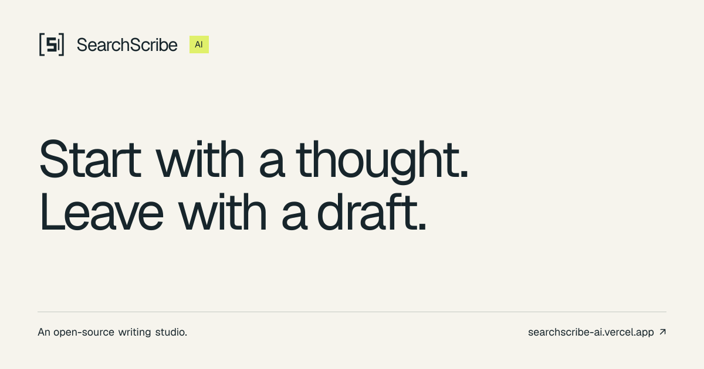
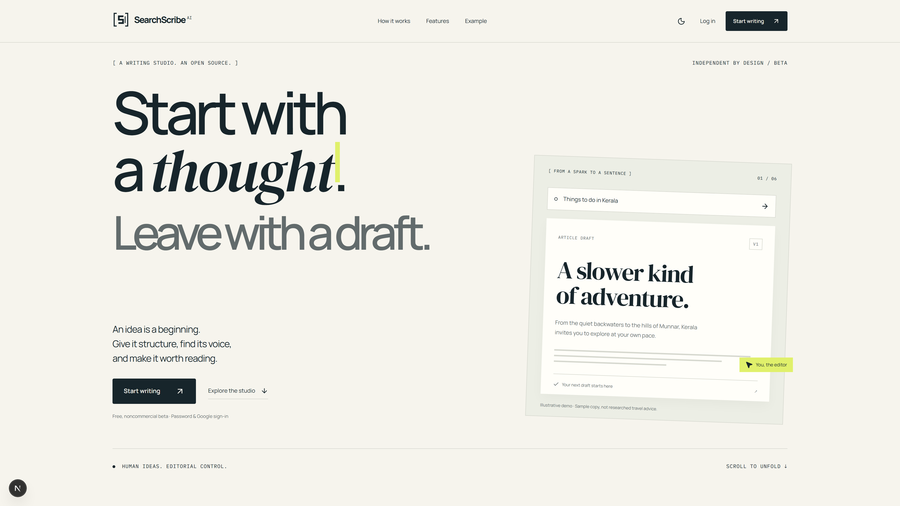
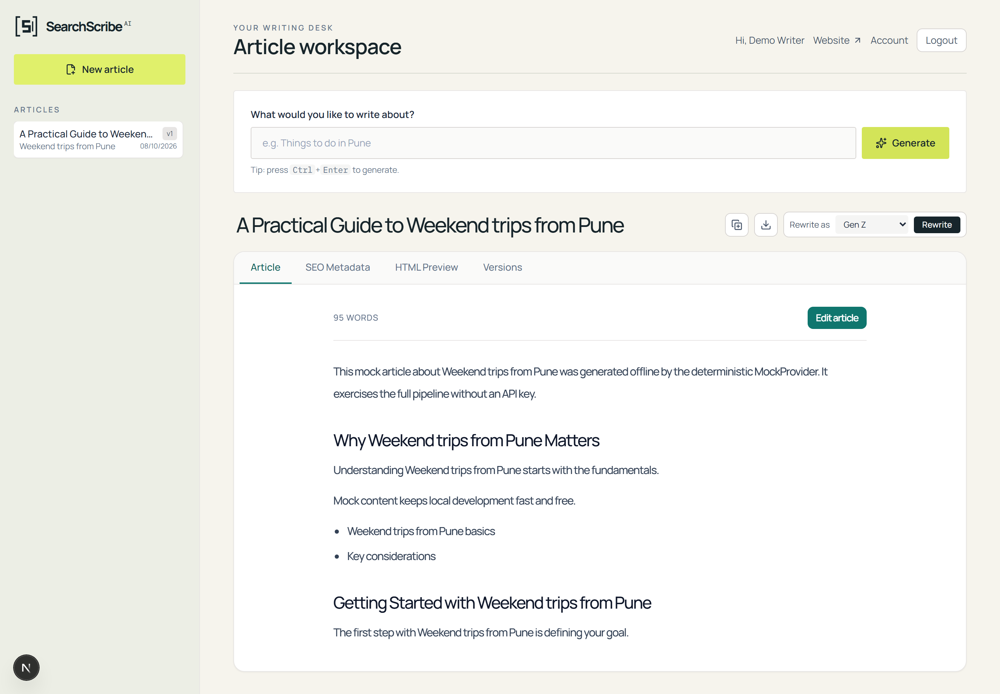
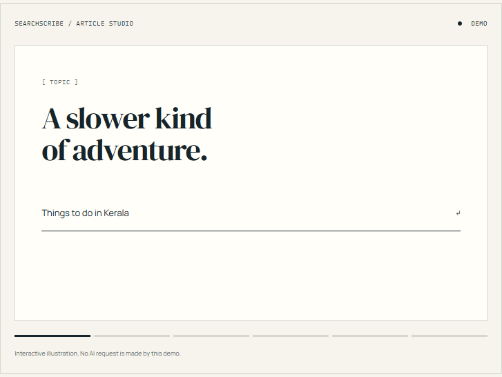

# SearchScribe AI



**An open-source writing studio. Turn a topic into a structured draft, make it your own, and export HTML.**

[Try the website](https://searchscribe-ai.vercel.app/) · [How it works](https://searchscribe-ai.vercel.app/how-it-works) · [Contribute](CONTRIBUTING.md) · [MIT license](LICENSE)

[](https://github.com/abhay-yemekar/SearchScribe_AI_Studio/actions/workflows/ci.yml)

SearchScribe is built for bloggers and creators who want an editable starting point
and control over the result. AI supplies a draft; the writer reviews the facts,
changes the language, and decides what to publish.

## The writing journey

1. **Start with a topic.** Generate a title, introduction, sections, conclusion,
   and SEO metadata through the configured Gemini provider.
2. **Shape the article.** Edit the structured content and SEO fields. Save a new
   version; stale edits are rejected rather than silently overwriting newer work.
3. **Try another voice.** Rewrite in Professional, Casual, Gen Z, Technical,
   Marketing, or Minimal style.
4. **Keep your history.** Inspect and restore saved versions. Restoration creates
   another version instead of erasing the intervening work.
5. **Take the result with you.** Preview and download standalone, sanitized HTML.

The public website explains the product before login. `/dashboard` is the writing
workspace; `/account` manages sign-in connections. Password signup and login remain
available alongside the configured Google sign-in integration.

## A look inside



The redesigned homepage, captured from the running local app. Its article scene
uses clearly labeled sample copy.



The working editor with a synthetic **Demo Writer** account and an offline mock
article. This demonstrates the interface, not live AI output or researched advice.



A short capture of the homepage's **prewritten walkthrough**, not a recording of
AI generating content. Static alternatives: [homepage](screenshots/redesign-home-hero.png)
and [workspace](screenshots/redesign-workspace.png).

## Beta status

This is a **free, noncommercial beta in progress**, not a completed public release.
The deployed password journey has been checked through real generation, editing,
version restoration, and HTML export. Google sign-in is deployed; real-identity
login and explicit account-linking acceptance checks remain pending. Matching
emails do not silently merge accounts.

The following are **not shipped**: password-reset emails, email verification,
research citations, photo suggestions, Markdown download, persistent daily AI
quotas, and provider fallback. Backup restore and deployment rollback rehearsals
also remain release gates. Follow the [launch plan](docs/launch-plan.md) for scope
and acceptance criteria. AI drafts need human review before publication.

## Run it locally

Prerequisites: **Python 3.12+**, **Node.js 20.9+**, and npm. SQLite and the mock AI
provider let you develop without Docker, a cloud account, or a paid API key.

The commands below use Windows PowerShell. On macOS/Linux, use `.venv/bin/python`
instead of `.venv\Scripts\python.exe`, and `cp` instead of `Copy-Item`.

```powershell
git clone https://github.com/abhay-yemekar/SearchScribe_AI_Studio.git
cd SearchScribe_AI_Studio
python -m venv .venv
.\.venv\Scripts\python.exe -m pip install -r backend/requirements.txt -r backend/requirements-dev.txt
Copy-Item backend/.env.example backend/.env
```

In `backend/.env`, set `AI_PROVIDER=mock` for deterministic local drafts. Keep
`APP_ENV=local` and the SQLite default. Set your own random `SECRET_KEY`; generate
one with `python -c "import secrets; print(secrets.token_urlsafe(48))"`. Do not
commit environment files. The mock provider produces sample content, not research
or live AI output.

Start the API:

```powershell
cd backend
../.venv/Scripts/python.exe -m alembic upgrade head
../.venv/Scripts/python.exe -m uvicorn app.main:app --reload
```

In another terminal, from the repository root:

```powershell
cd frontend
npm ci
npm run dev
```

Open [localhost:3000](http://localhost:3000). API documentation is at
[127.0.0.1:8000/docs](http://127.0.0.1:8000/docs). Next.js forwards `/api/*` to
the API; `BACKEND_URL` changes its destination. If you change ports, update that
setting and any configured Google authorized JavaScript origin together.

For real generation, select `AI_PROVIDER=gemini` and put your own `GEMINI_API_KEY`
in the backend environment. `AI_MODEL` selects an available model. Provider
accounts, limits, and data-use terms apply; the MIT license does not include API
credits. Google login is optional for self-hosting and needs a web client ID and
matching site origin. See the [authentication setup guide](docs/auth-setup.md).

## Stack and deployment

| Layer              | Implementation                                                                    |
| ------------------ | --------------------------------------------------------------------------------- |
| Website and studio | Next.js 16 App Router, React 19, TypeScript, Tailwind CSS, TanStack Query         |
| API                | FastAPI, Pydantic, SQLAlchemy 2, Alembic                                          |
| Generation         | Gemini through a provider protocol; mock provider for local development and tests |
| Storage            | SQLite locally; persistent Postgres in production                                 |
| Validation         | Ruff, mypy, pytest, ESLint, TypeScript, Vitest, Playwright, Docker builds         |

The current personal beta uses **Vercel → Render → Neon Postgres**. Vercel's
server-side proxy keeps browser API requests on the website origin. Render runs
migrations before starting the API. Production settings require Postgres and a
strong signing secret and refuse the mock provider.

Self-hosting requires your own frontend, API, persistent Postgres, and provider
configuration. Free service plans have limits and cold starts; they do not promise
unlimited or always-on capacity. Vercel Hobby is for personal, noncommercial use.
See [deployment](docs/deployment.md) for configuration, optional Docker Compose,
backups, and rollback procedures. No production credentials belong in this repo.

## Check a change

From `backend`:

```powershell
../.venv/Scripts/python.exe -m ruff check .
../.venv/Scripts/python.exe -m mypy app
../.venv/Scripts/python.exe -m pytest
```

From `frontend`:

```powershell
npm run lint
npm run typecheck
npm test
npm run build
npx playwright install chromium
npx playwright test
```

Playwright starts an isolated mock API on `:8001` and a frontend on `:3100`.
GitHub Actions additionally runs backend tests against SQLite and Postgres.
See [testing](docs/testing.md) for environment details.

## Build in the open

Start with an issue describing the user problem. Use a feature branch and
Conventional Commits; open a PR, pass the current CI checks, review the diff, and
squash merge. See [CONTRIBUTING.md](CONTRIBUTING.md). Keep planned features separate
from shipped behavior and preserve existing user content.

Useful references: [architecture](docs/architecture.md), [AI pipeline](docs/ai-architecture.md),
[API](docs/api.md), [database](docs/database.md), [security](docs/security.md),
[design system](docs/design-system.md), and [brand assets](docs/brand.md).

Maintained by [Abhay Yemekar](https://github.com/abhay-yemekar). Licensed under
[MIT](LICENSE).
