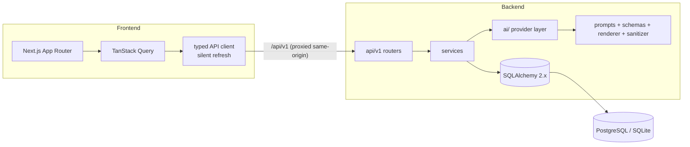

# Architecture

## Style

SearchScribe is a **modular monolith**: one deployable backend, clear internal boundaries, no premature distribution. Routers stay thin; services own business rules; repositories own data access; the AI package hides every provider detail behind one protocol.



## Request lifecycle

1. Browser calls same-origin `/api/v1/...` (Next.js rewrites proxy to the backend).
2. `RequestContextMiddleware` assigns a request ID, exposes it to logs and the `X-Request-ID` header.
3. `SecurityHeadersMiddleware` attaches `X-Content-Type-Options`, `Referrer-Policy`, `X-Frame-Options`, CSP; auth responses get `Cache-Control: no-store`.
4. Rate-limit dependencies (auth: 10/min, generation: 5/min per client).
5. Dependencies resolve the DB session and current user (Bearer JWT).
6. The router delegates to a service; repositories persist; exceptions surface through the central handlers as `{error: {code, message, request_id}}`.

## Layers and responsibilities

| Layer | Location | Responsibility |
| --- | --- | --- |
| Routers | `app/api/v1/` | HTTP concerns only: parsing, status codes, dependency wiring |
| Schemas | `app/schemas/` | Pydantic request/response contracts |
| Services | `app/services/` | Business rules, orchestration, transactions, logging events |
| Repositories | `app/repositories/` | User-scoped queries and writes; no business logic |
| AI layer | `app/ai/` | Provider protocol, Gemini/Mock providers, prompts, structured-output schemas, deterministic renderer, sanitizer |
| Core | `app/core/` | Settings, security primitives, logging, errors, rate limiting |

## Frontend architecture

- **Feature-based**: `features/auth`, `features/articles` own their components; `components/shared` holds cross-cutting UI (accessible tabs, skeletons, banners).
- **Server state** via TanStack Query (`articles`, `article/:id`, `versions`, `rewrite-styles` queries + mutations with cache invalidation).
- **Token strategy**: access JWT in a module-level store (`lib/auth/token-store.ts`) mirrored into React via `useSyncExternalStore`; never persisted. The API client silently calls `/auth/refresh` (HttpOnly cookie travels automatically because everything is same-origin) and retries once on 401.
- **Zod schemas** in `lib/api/schemas.ts` mirror backend contracts and parse every response.

## Key flows

### Generation

```
query → validation (length) → provider resolution
      → article_generation prompt (retry on transient errors only)
      → Pydantic validation (GeneratedArticle)
      → seo_generation prompt → normalize_seo clamps
      → Jinja2 render → nh3 sanitize
      → persist Article + version 1 + SEO + generation rows
```

Failures never fabricate content: a failed article pass records a `generations` row with `status=failed` and returns a typed `GENERATION_FAILED` error. A failed SEO pass degrades to deterministic fallback metadata (article itself is not fake).

### Rewrite

`style key → style registry → rewrite prompt → validated GeneratedArticle → new immutable version`. Restores copy an old version forward; history is append-only.

## Scaling notes

- The API is stateless (sessions live in the DB) — run multiple workers/replicas behind a load balancer.
- The in-memory rate limiter is process-local; swap `SlidingWindowLimiter` for a Redis implementation when running multiple replicas (Redis is already provisioned in compose for this).
- Long generations can move to a queue + worker without touching routes/services: create the article row in `status=generating`, run the existing service pipeline in the worker, flip to `ready`.
