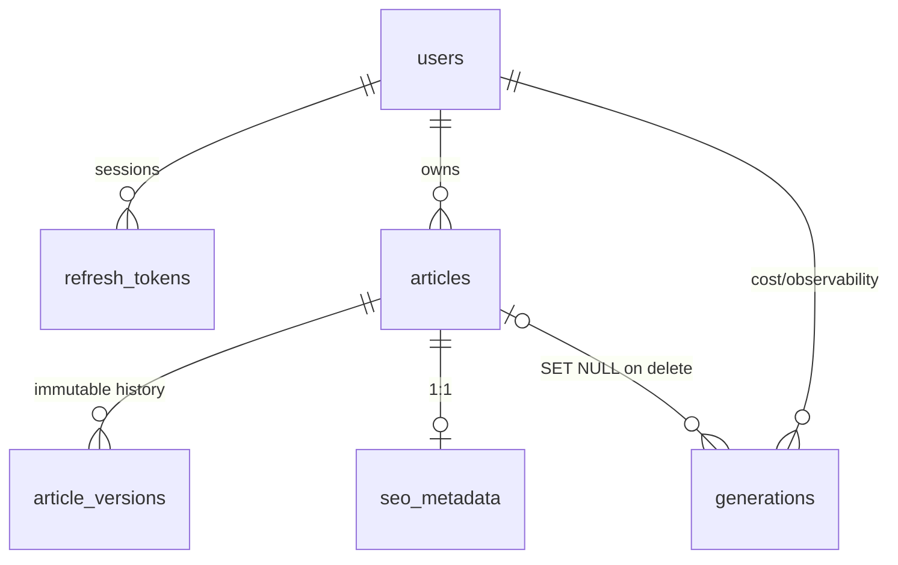

# Database

## Engines

One SQLAlchemy 2.x code path serves both engines:

- **SQLite** — local development and tests (zero setup).
- **PostgreSQL 16** — docker-compose / production (`postgresql+psycopg://`).

Dialect differences are handled in two places: `connect_args` for SQLite in `app/db/session.py`, and `sa.JSON().with_variant(JSONB, "postgresql")` for the keywords column.

## Schema



| Table | Purpose | Notable constraints |
| --- | --- | --- |
| `users` | accounts | unique indexed email, `is_active`, `last_login_at`, timestamps |
| `refresh_tokens` | server-side sessions | unique SHA-256 `token_hash`, `expires_at`, `revoked_at`; CASCADE on user delete |
| `articles` | user-owned documents | `user_id` FK CASCADE + index, `status` (`ready`/`failed`) |
| `article_versions` | immutable content snapshots | unique `(article_id, version)`, `change_type` (`generation`/`rewrite`/`restore`) |
| `seo_metadata` | 1:1 SEO per article | unique `article_id`, keywords as JSON/JSONB |
| `generations` | per-LLM-call metadata | `article_id` nullable SET NULL (analytics survive article deletion), tokens/latency/status |

All constraint names follow a deterministic naming convention (`app/db/base.py`) so migrations stay stable across engines.

## Migrations

Alembic owns the schema; `Base.metadata.create_all` is never used at runtime.

```bash
cd backend
python -m alembic upgrade head                       # apply
python -m alembic revision --autogenerate -m "..."   # create
python -m alembic downgrade -1                       # roll back one
```

`alembic/env.py` takes the URL from app settings (`DATABASE_URL`), supports batch mode for SQLite ALTER limitations, and enables `compare_type`. The backend Docker image runs `alembic upgrade head` before starting uvicorn.

## Content representation

`article_versions.content` stores the canonical `GeneratedArticle` JSON. Markdown is derived on read (`to_markdown()`) and HTML on read via the deterministic renderer — one source of truth, no duplicated storage that can drift.

## Pagination

Listing endpoints use **cursor pagination** (`?limit=&cursor=`) keyed on `article_id DESC` — stable under concurrent writes, constant memory, no OFFSET scans. The API returns `next_cursor` when more rows exist.
